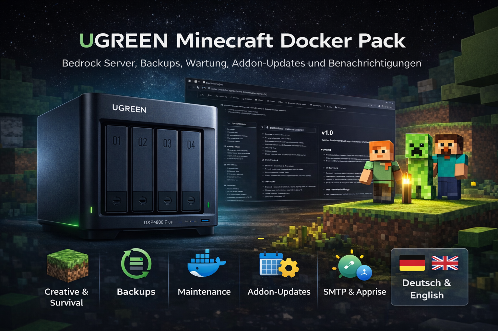

# UGREEN Minecraft Docker Pack



## Deutsch

Community-Projekt für **UGREEN NAS / UGOS** mit einem oder zwei **Minecraft Bedrock**-Servern, automatischen **Bedrockifier**-Backups, einem **Maintenance**-Container, Addon-Update-Automatisierung, Watchdog-Prüfungen, kontrolliertem **Autoheal** und **SMTP / Apprise**-Benachrichtigungen.

### Enthalten

- `minecraft_server/` als kompletter Projektordner für UGOS Docker
- zweisprachige `.env` mit deutschen und englischen Kommentaren
- optionale Creative- und Survival-Serverprofile
- Backup-Container mit konfigurierbaren Zielen und Intervallen
- Maintenance-Skripte für Benachrichtigungen, Watchdog und Addon-Updates
- `railsimulatornet/minecraft-maintenance:1.0.1` als festes Multi-Arch-Maintenance-Image
- `railsimulatornet/autoheal:1.0.0` mit Cooldown und Schutz vor Neustartschleifen
- persistente Autoheal-Neustarthistorie im lokalen Ordner `autoheal-state/`
- relative Projektpfade für eine UGOS-freundliche Bereitstellung
- Installationshandbuch als PDF

### Ordnerstruktur

```text
minecraft_server/
├── .env
├── docker-compose.yaml
├── Dockerfile.mc_maintenance
├── addons_repo/
├── autoheal-state/        # wird beim ersten Start angelegt
├── backup/
├── creative/
├── maintenance/
└── survival/
```

Die `Dockerfile.mc_maintenance` bleibt im Repository als nachvollziehbare Build-Quelle für `railsimulatornet/minecraft-maintenance`. Die produktive Compose-Datei baut sie nicht lokal, sondern verwendet das veröffentlichte Image. Im bereinigten ZIP-Benutzerpaket ist die Dockerfile deshalb nicht enthalten.

### Schnellstart

1. Repository oder Release herunterladen.
2. `minecraft_server/.env` anpassen.
3. Den kompletten Ordner `minecraft_server/` in die Docker-Freigabe der NAS kopieren.
4. In UGOS **Docker -> Projekt -> Erstellen** öffnen.
5. Den vorhandenen Ordner `minecraft_server` auswählen.
6. Die vorhandene `docker-compose.yaml` importieren.
7. Projekt bereitstellen und den ersten Start vollständig abwarten.

### Maintenance 1.0.1

Das Docker Pack verwendet den festen Tag `railsimulatornet/minecraft-maintenance:1.0.1`. Das Image wird für `linux/amd64` und `linux/arm64` veröffentlicht. Vor einer Veröffentlichung wird ein frischer Build mit Trivy auf behebbare HIGH- und CRITICAL-Sicherheitsfunde geprüft. Veröffentlichte Images enthalten außerdem SBOM- und Provenance-Attestierungen.

### Autoheal 1.0.0

Das Docker Pack verwendet den festen produktiven Tag `railsimulatornet/autoheal:1.0.0`. Autoheal überwacht passend markierte Container mit einem Docker-Healthcheck und startet sie bei `unhealthy` kontrolliert neu.

Die Standardkonfiguration enthält:

- 120 Sekunden Startphase
- 30 Sekunden Prüfintervall
- 300 Sekunden Cooldown zwischen Neustarts
- höchstens 3 Neustarts innerhalb von 1800 Sekunden
- persistente Neustarthistorie unter `./autoheal-state`
- Dry-Run- und Debug-Optionen in der `.env`

Der Backup-Healthcheck prüft den internen Dienst auf TCP-Port 8080 und verwendet eine Startphase von 150 Sekunden. Dadurch wird kein im Image nicht vorhandenes Healthcheck-Skript mehr aufgerufen und Autoheal gerät nicht durch einen dauerhaft falschen Zustand in eine Neustartschleife.

### Aktualisierung einer vorhandenen Installation

Die eigene produktive `.env` nicht vollständig überschreiben. Stattdessen mindestens die neuen beziehungsweise geänderten `AUTOHEAL_*`-Werte aus der Repository-Datei übernehmen und anschließend die neue `docker-compose.yaml` verwenden. Für eine reproduzierbare Installation sollten die festen Image-Tags `railsimulatornet/minecraft-maintenance:1.0.1` und `railsimulatornet/autoheal:1.0.0` beibehalten werden.

### Sicherheitshinweis

Autoheal benötigt Zugriff auf `/var/run/docker.sock`, um Container neu starten zu können. Dieser Socket ermöglicht weitreichende Kontrolle über Docker und damit faktisch über den Host. Verwende ausschließlich vertrauenswürdige Images und schütze Projektdateien und Docker-Zugriff vor unberechtigten Änderungen.

### Hinweise

- Dies ist ein **Community-Projekt**, kein offizielles UGREEN-Produkt.
- Verwendung auf eigene Verantwortung.
- Die ausführliche Schritt-für-Schritt-Anleitung befindet sich im mitgelieferten PDF-Handbuch.

### Copyright

Copyright (c) 2026 Roman Glos / Railsimulatornet

---

## English

Community project for **UGREEN NAS / UGOS** with one or two **Minecraft Bedrock** servers, automatic **Bedrockifier** backups, a **Maintenance** container, addon update automation, watchdog checks, controlled **Autoheal** recovery and **SMTP / Apprise** notifications.

### Included

- `minecraft_server/` as the full project folder for UGOS Docker
- bilingual `.env` with German and English comments
- optional creative and survival server profiles
- backup container with configurable targets and intervals
- maintenance scripts for notifications, watchdog checks and addon updates
- `railsimulatornet/minecraft-maintenance:1.0.1` as the pinned multi-architecture maintenance image
- `railsimulatornet/autoheal:1.0.0` with cooldown and restart-loop protection
- persistent Autoheal restart history in the local `autoheal-state/` directory
- relative project paths for UGOS-friendly deployment
- installation manual as PDF

### Directory layout

```text
minecraft_server/
├── .env
├── docker-compose.yaml
├── Dockerfile.mc_maintenance
├── addons_repo/
├── autoheal-state/        # created on first startup
├── backup/
├── creative/
├── maintenance/
└── survival/
```

`Dockerfile.mc_maintenance` remains in the repository as the reproducible build source for `railsimulatornet/minecraft-maintenance`. The production Compose file does not build it locally and uses the published image instead. The Dockerfile is therefore excluded from the clean user ZIP package.

### Quick start

1. Download the repository or release.
2. Adjust `minecraft_server/.env`.
3. Copy the complete `minecraft_server/` folder into your NAS Docker share.
4. In UGOS, open **Docker -> Project -> Create**.
5. Select the existing `minecraft_server` folder.
6. Import the existing `docker-compose.yaml`.
7. Deploy the project and wait until the first startup is fully complete.

### Maintenance 1.0.1

The Docker Pack uses the pinned tag `railsimulatornet/minecraft-maintenance:1.0.1`. The image is published for `linux/amd64` and `linux/arm64`. Before publication, a fresh build is checked with Trivy for fixable HIGH and CRITICAL security findings. Published images also include SBOM and provenance attestations.

### Autoheal 1.0.0

The Docker Pack uses the fixed production tag `railsimulatornet/autoheal:1.0.0`. Autoheal monitors selected containers with a Docker healthcheck and restarts them in a controlled manner when they become `unhealthy`.

The default configuration includes:

- 120-second startup delay
- 30-second check interval
- 300-second cooldown between restarts
- no more than 3 restarts within 1800 seconds
- persistent restart history under `./autoheal-state`
- dry-run and debug options in `.env`

The backup healthcheck tests the internal service on TCP port 8080 and uses a 150-second startup period. This avoids calling a healthcheck script that is not present in the image and prevents Autoheal from entering a restart loop because of a permanently incorrect health state.

### Updating an existing installation

Do not completely overwrite your customized production `.env`. Instead, copy at least the new or changed `AUTOHEAL_*` values from the repository file and then use the new `docker-compose.yaml`. For reproducible deployments, keep the pinned image tags `railsimulatornet/minecraft-maintenance:1.0.1` and `railsimulatornet/autoheal:1.0.0`.

### Security notice

Autoheal requires access to `/var/run/docker.sock` so it can restart containers. This socket provides extensive control over Docker and effectively over the host. Use only trusted images and protect project files and Docker access from unauthorized changes.

### Notes

- This is a **community project**, not an official UGREEN product.
- Use at your own risk.
- The detailed step-by-step guide is included in the PDF manual.

### Copyright

Copyright (c) 2026 Roman Glos / Railsimulatornet
